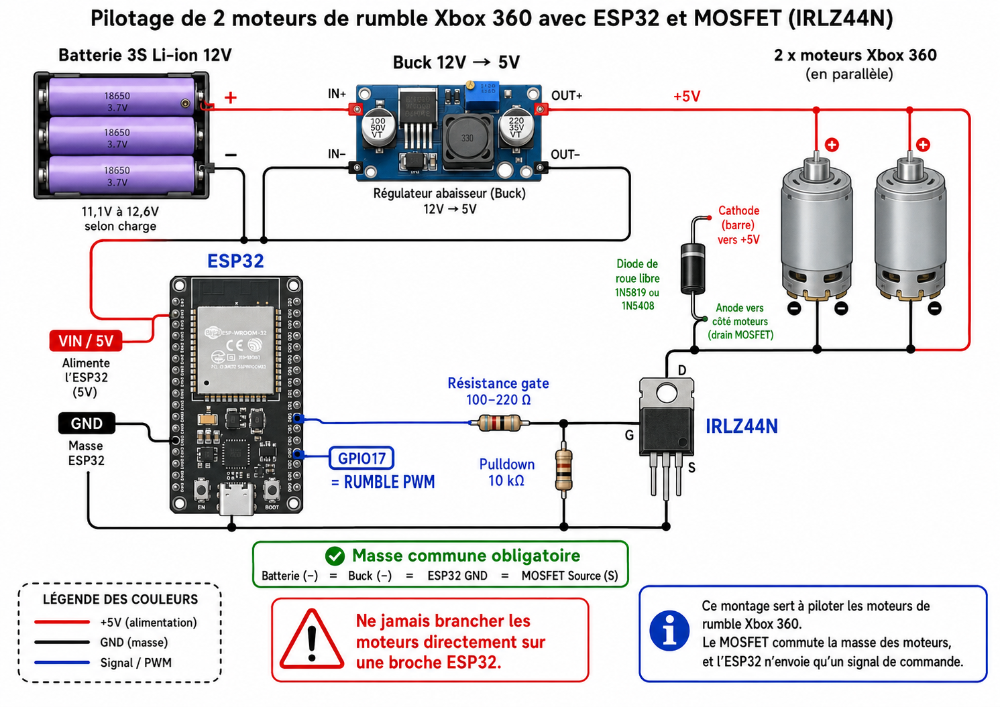

# ESP32 VR Haptic Trigger V3

<!-- AUTO REF 01 -->


Standalone, hardware-validated ESP32 firmware for a DIY VR haptic gun / gunstock controller using Bluetooth Classic SPP and a ForceTube-compatible haptic protocol.

This repository contains **Trigger V3 only**. Historical V1/V2 firmware variants are not part of this standalone project.

> Not affiliated with ProTubeVR. `ForceTube` is referenced only to describe protocol compatibility observed during development.

## Validated baseline

- Firmware tag: `v3.0.0-validated`
- Original internal V3 source baseline: `913fefff49d51f9b65072eacdb34fa90991b474a`
- Target: classic ESP32 with Bluetooth Classic SPP
- Runtime communication: **Bluetooth only - no Wi-Fi**
- Final controls: GPIO13 TRIGGER + GPIO14 PROFILE/MODE
- GPIO4: unused/free
- OLED: SSD1306 128x64 at I2C address `0x3C`
- Recoil: BTS7960 + solenoid
- Rumble: GPIO17 PWM through an external MOSFET driver stage
- Status LEDs: two WS2812B on GPIO16

The final COMPAT build was physically validated with OLED, buttons, local profiles, Bluetooth/APK haptics, Bluetooth disconnect/reconnect, APK restart and physical reset.

## Design concept


These original Trigger V3 concept images were recovered from the development repository. They are design references, not final mechanical dimensions.

See [docs/DESIGN.md](docs/DESIGN.md).

## Runtime architecture

```text
Quest 3 / Android haptic application
                |
        Bluetooth Classic SPP
                |
        ForceTube packet parser
                |
         HapticController
          /           \
 GPIO17 rumble      BTS7960
      |               |
 MOSFET stage      recoil solenoid
      |
 rumble motors

GPIO13 trigger -> TRIGGER_FALLBACK -> selected local profile
GPIO14 short   -> next profile
GPIO14 long    -> HAPTIC_ONLY / TRIGGER_FALLBACK
```

The Bluetooth and local-trigger paths share the same `HapticController`. Overlapping non-zero KICK requests are inhibited instead of queued and replayed late.

## Final pinout

| Function | ESP32 GPIO | Notes |
|---|---:|---|
| Trigger | 13 | active LOW, `INPUT_PULLUP` |
| Profile / mode button | 14 | short = next profile; long ~1 s = mode toggle |
| Rumble PWM | 17 | 175 Hz, 8-bit |
| BTS7960 RPWM | 23 | recoil control |
| BTS7960 LPWM | 5 | recoil control |
| WS2812B data | 16 | two LEDs |
| Buzzer | 27 | optional feedback |
| OLED SDA | 21 | I2C |
| OLED SCL | 22 | I2C |
| Free / unused | 4 | intentionally unused |

Buttons connect between their GPIO and GND and use internal pull-ups.

See [docs/PINOUT.md](docs/PINOUT.md) for the exact 30-pin breakout terminal mapping.

## Manual profiles

| Profile | Behavior | Kick | Rumble | Timing |
|---|---|---:|---:|---|
| PISTOL | SINGLE | 120 | 0 | no rumble |
| SNIPER | SINGLE | 255 | 128 | short 120 ms rumble pulse |
| M16 | AUTO | 240 | 125 | 150 ms repeat |
| P90 | AUTO | 220 | 159 | 150 ms repeat |
| PKM | AUTO | 129 | 255 | 150 ms repeat |
| LASER | CHARGE_RELEASE | 255 | 0 to 255 | 20 steps over 2600 ms, then KICK and rumble stop |

SNIPER rumble stops automatically after about 120 ms even if the trigger remains held. M16, P90 and PKM keep their manual rumble active while the trigger is held.

## ForceTube-compatible Bluetooth protocol

```text
byte 0 = 0x2A
byte 1 = 0xB0
byte 2 = 0x00 KICK / 0x01 RUMBLE
byte 3 = intensity 0..255
```

Bluetooth name:

```text
ForceTubeVR 1187883197
```

See [docs/PROTOCOL.md](docs/PROTOCOL.md).

## Rumble hardware



The detailed original wiring reconstruction is preserved and indexed in [docs/RUMBLE_WIRING.md](docs/RUMBLE_WIRING.md).

## Build

Safe build:

```powershell
pio run -e trigger-v3-safe
```

Physical actuator build:

```powershell
pio run -e trigger-v3-compat
```

Before a physical flash, read [docs/FLASHING.md](docs/FLASHING.md).

## Quick start: clone, build and flash

### Clone

```powershell
git clone https://github.com/alfawalidou/esp32-vr-haptic-trigger-v3.git
cd esp32-vr-haptic-trigger-v3
```

### PlatformIO CLI

Check that PlatformIO is available:

```powershell
pio --version
```

If it is not installed:

```powershell
python -m pip install --upgrade platformio
pio --version
```

### Build only

SAFE build, with physical actuator output disabled:

```powershell
powershell -ExecutionPolicy Bypass -File .\scripts\build.ps1 -Mode Safe
```

COMPAT build, with physical actuator output enabled:

```powershell
powershell -ExecutionPolicy Bypass -File .\scripts\build.ps1 -Mode Compat
```

### Build + full erase + flash

```powershell
powershell -ExecutionPolicy Bypass -File .\scripts\flash.ps1 -Port COMx
```

Replace `COMx` with the ESP32 serial port reported by `pio device list`. The helper performs:

```text
clean
build trigger-v3-compat
full flash erase
upload
```

### Serial monitor

```powershell
powershell -ExecutionPolicy Bypass -File .\scripts\monitor.ps1 -Port COMx
```

The monitor helper always uses the validated settings:

```text
115200 baud
RTS inactive
DTR inactive
```

Equivalent direct command:

```powershell
pio device monitor -p COMx -b 115200 --rts 0 --dtr 0
```

### Shortest validated workflow

After cloning:

```powershell
powershell -ExecutionPolicy Bypass -File .\scripts\flash.ps1 -Port COMx
powershell -ExecutionPolicy Bypass -File .\scripts\monitor.ps1 -Port COMx
```

> Use `trigger-v3-safe` for first wiring checks. Use `trigger-v3-compat` only when the recoil and rumble power stages are ready.

## Documentation

- [Documentation index](docs/DOCUMENTATION_INDEX.md)
- [Firmware architecture](docs/ARCHITECTURE.md)
- [Final hardware and wiring](docs/HARDWARE.md)
- [Final pinout and breakout mapping](docs/PINOUT.md)
- [Bill of materials](docs/BOM.md)
- [Rumble / IRLZ44N wiring](docs/RUMBLE_WIRING.md)
- [Mechanical and visual design](docs/DESIGN.md)
- [Profiles and local controls](docs/PROFILES.md)
- [ForceTube-compatible protocol](docs/PROTOCOL.md)
- [Build, erase, flash and serial monitor](docs/FLASHING.md)
- [Validated test matrix](docs/VALIDATION.md)
- [Original Trigger V3 engineering archive](docs/reference-original/README.md)
- [Future public-release checklist](docs/PUBLIC_RELEASE_CHECKLIST.md)

## Repository layout

```text
.
|-- include/
|   |-- BootHealth.h
|   |-- ForceTubeProtocol.h
|   |-- HapticController.h
|   |-- HapticProfiles.h
|   `-- TriggerV3Config.h
|-- src/
|   |-- BootHealth.cpp
|   |-- HapticController.cpp
|   `-- main.cpp
|-- assets/
|   |-- design/
|   `-- hardware/
|-- docs/
|   |-- reference-original/
|   `-- ...
|-- scripts/
|-- platformio.ini
|-- CHANGELOG.md
`-- VERSION
```

The layout deliberately uses plain ASCII tree characters so it renders correctly regardless of Windows shell/editor code page.

## Safety

ESP32 GPIO pins provide logic/control signals only. Never power the recoil solenoid or rumble motors directly from an ESP32 GPIO.

Verify the actual power source, measured current, fuse/protection, wire gauge, connectors, MOSFET stage, BTS7960 cooling, common ground strategy and mechanical mounting before energizing a rebuild.

## License

No open-source license has been selected yet. Keep the repository private until the public-release checklist is reviewed and the intended license is added.
