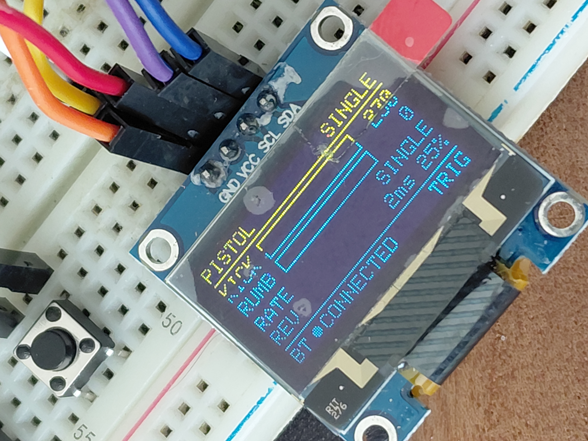
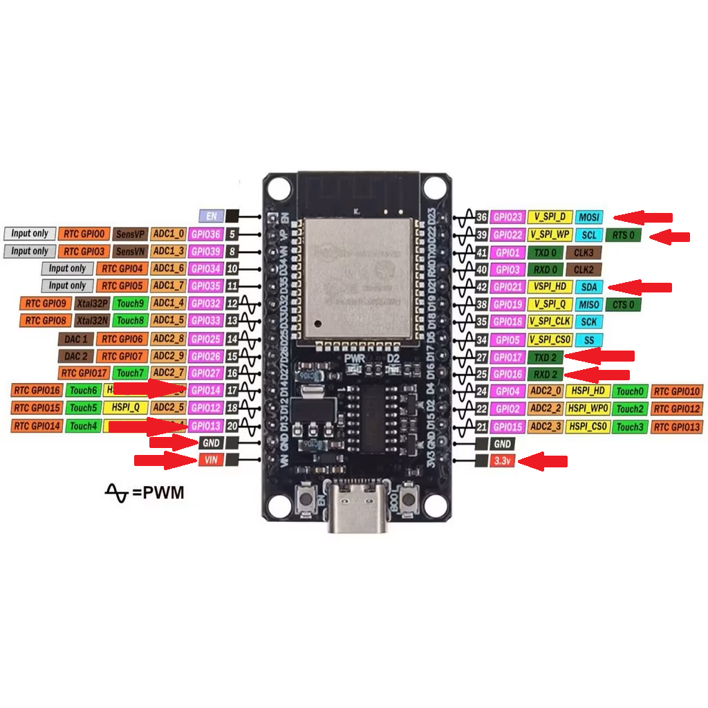
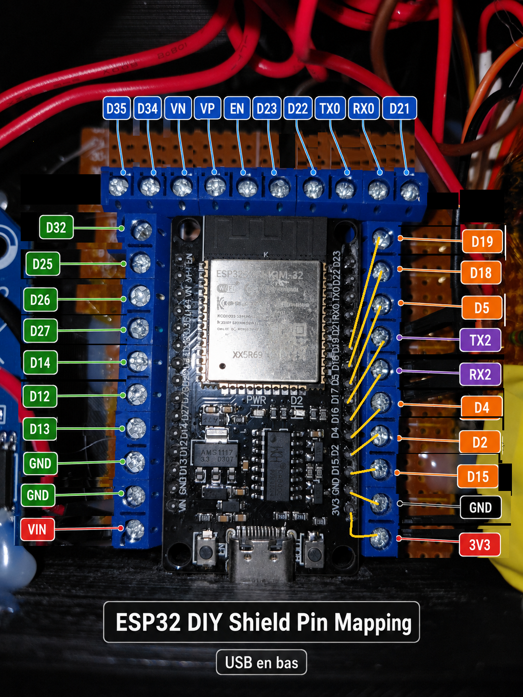
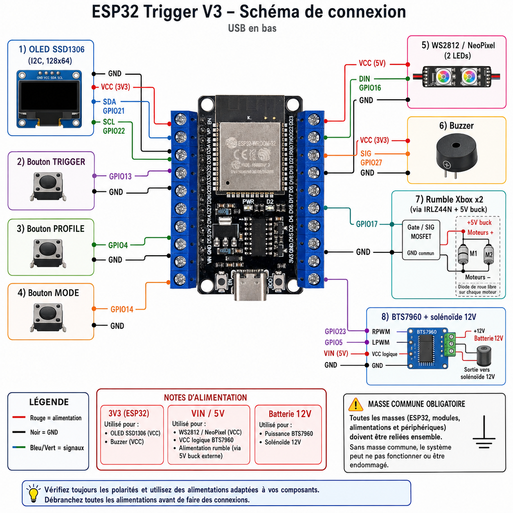
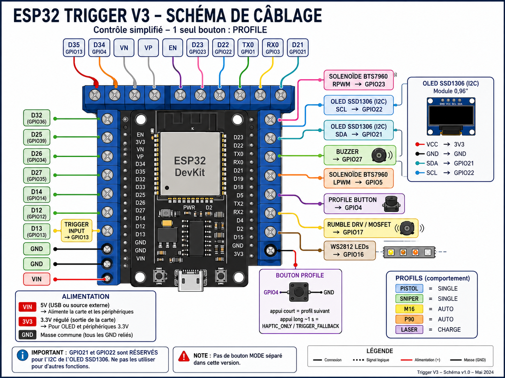

# Hardware and wiring

This document describes the **current Trigger V3 validated wiring only**.

## ESP32 requirements

Use a classic ESP32 variant that supports **Bluetooth Classic SPP**. Do not assume ESP32-S2/S3/C3 are drop-in replacements for this firmware.

## Validated GPIO map

| GPIO | Function | Notes |
|---:|---|---|
| 23 | BTS7960 RPWM | recoil driver control |
| 5 | BTS7960 LPWM | recoil driver control |
| 17 | Rumble PWM | 175 Hz, 8-bit |
| 16 | WS2812B data | two status LEDs |
| 13 | Trigger | active LOW, `INPUT_PULLUP` |
| 14 | Profile / mode button | active LOW, `INPUT_PULLUP` |
| 27 | Buzzer | local feedback |
| 21 | OLED SDA | I2C, 3.3 V logic |
| 22 | OLED SCL | I2C, 3.3 V logic |
| 4 | Free | intentionally unused |

OLED address: `0x3C`, 128×64 SSD1306.

## Recoil path

```text
ESP32 GPIO23 / GPIO5
        │
        ▼
     BTS7960
        │
        ▼
 recoil solenoid
```

Validated haptic constants:

- kick command range: 215–255 after mapping
- forward duration: 30 ms
- reverse pulse: 2 ms
- reverse level: 25% of requested kick
- prototype class referenced in firmware: 1564B + BTS7960

The solenoid is not powered from the ESP32.

## Rumble path

```text
ESP32 GPIO17 PWM
        │
        ▼
  MOSFET driver stage
        │
        ▼
 rumble motors
```

Validated prototype topology uses an external IRLZ44N-based low-side driver stage. The motor power rail feeds the motors; GPIO17 drives only the MOSFET gate/control path. Grounds are common.

The hardware stage must include appropriate gate biasing, flyback/transient protection and current-rated wiring.

Firmware values:

- PWM frequency: 175 Hz
- resolution: 8-bit
- intensity: 0–255
- watchdog: 500 ms
- hardware apply interval: 10 ms

## BTS7960 protection

The validated prototype includes a `1.5KE24CA` TVS across the BTS7960 motor outputs (`M+` / `M-`).

## Buttons

Both buttons use internal pull-ups.

```text
GPIO13 ── trigger switch ── GND
GPIO14 ── profile switch ── GND
```

GPIO14 behavior:

- short press: next profile
- long press (~1 s): toggle `HAPTIC_ONLY` / `TRIGGER_FALLBACK`

GPIO4 is not used by the final two-button design.

## OLED — important power wiring

The **strongly recommended and physically validated wiring** for this prototype is:

```text
external regulated 5 V buck OUT ── OLED VCC
common GND                       ── OLED GND
ESP32 GPIO21                     ── OLED SDA
ESP32 GPIO22                     ── OLED SCL
```

**Do not power the OLED from the ESP32 `3V3` pin on the validated prototype.** During troubleshooting, the OLED VCC lead connected to ESP32 `3V3` was correlated with severe ESP32 / Bluetooth instability under haptic operation, even when the far end of that lead was disconnected from the OLED. Moving OLED VCC to the regulated external 5 V buck output produced stable autonomous operation over repeated multi-minute tests.

For the exact OLED module used on the prototype, measurements with OLED VCC at 5 V showed SDA and SCL at approximately 3.2 V, which is compatible with the ESP32 3.3 V I2C logic used here.

This is **module-specific**. Before using 5 V VCC on another SSD1306 breakout:

- confirm that the module itself is rated for 5 V VCC;
- measure or verify its SDA/SCL pull-up voltage;
- do not connect SDA/SCL directly to the ESP32 if the breakout pulls them up to 5 V;
- keep the OLED and ESP32 on a common ground.

## WS2812B LEDs

GPIO16 drives two addressable LEDs. They indicate Bluetooth and haptic/profile state.

## Power architecture

Treat logic power and actuator power as separate engineering responsibilities even if both originate from one battery/source.

Validated / recommended structure for this prototype:

```text
battery / main supply
       │
       ├── regulated 5 V buck OUT ──┬── ESP32 VIN / 5V input
       │                            └── OLED VCC  (strongly recommended)
       │
       ├── recoil rail ── BTS7960 ── solenoid
       │
       └── rumble rail ── motors + MOSFET stage

ESP32 GPIO21/22 provide 3.3 V I2C logic only
all required control stages share the correct reference ground
```

Do not route OLED VCC from the ESP32 `3V3` pin on this validated build. Keep OLED power as a separate branch from the external regulated 5 V source.

Do not select wire gauge, fuse size, regulator rating or connector rating from firmware values alone; size them from measured actuator current.

<!-- BEGIN AUTO REF IMAGES -->

## Reference images











<!-- END AUTO REF IMAGES -->
