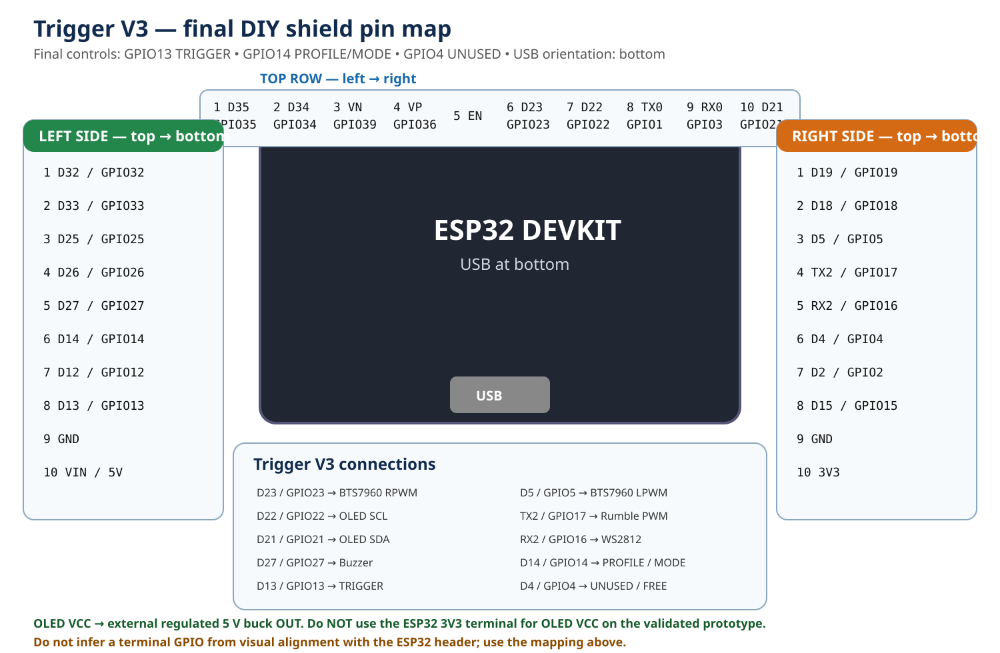

# Final Trigger V3 pinout and breakout mapping

This document is the **current standalone wiring authority** for Trigger V3.

```text
GPIO13 = TRIGGER
GPIO14 = PROFILE / MODE
GPIO4  = UNUSED / FREE
```

GPIO14 behavior:

```text
short press     -> next profile
long press ~1 s -> HAPTIC_ONLY <-> TRIGGER_FALLBACK
```

There is no separate MODE button in the final design.

## Final shield map

Use this diagram for the final DIY-shield terminal mapping:



Direct SVG link: [`trigger-v3-diy-shield-pinmap-final.svg`](assets/wiring/trigger-v3-diy-shield-pinmap-final.svg)

> Historical diagrams are kept under [`reference-original/trigger-v3/assets/wiring/`](reference-original/trigger-v3/assets/wiring/). Some of them predate the final GPIO14 migration and must **not** be used as current wiring instructions.

## Exact 30-pin breakout mapping

**Orientation: USB at the bottom.** Do not infer a GPIO from visual alignment with the ESP32 header.

### Top horizontal row — left to right

1. `D35 / GPIO35`
2. `D34 / GPIO34`
3. `VN / GPIO39`
4. `VP / GPIO36`
5. `EN`
6. `D23 / GPIO23`
7. `D22 / GPIO22`
8. `TX0 / GPIO1`
9. `RX0 / GPIO3`
10. `D21 / GPIO21`

### Left vertical row — top to bottom

1. `D32 / GPIO32`
2. `D33 / GPIO33`
3. `D25 / GPIO25`
4. `D26 / GPIO26`
5. `D27 / GPIO27`
6. `D14 / GPIO14`
7. `D12 / GPIO12`
8. `D13 / GPIO13`
9. `GND`
10. `VIN / 5V`

### Right vertical row — top to bottom

1. `D19 / GPIO19`
2. `D18 / GPIO18`
3. `D5 / GPIO5`
4. `TX2 / GPIO17`
5. `RX2 / GPIO16`
6. `D4 / GPIO4`
7. `D2 / GPIO2`
8. `D15 / GPIO15`
9. `GND`
10. `3V3`

> The `3V3` terminal above is listed only because it physically exists on the breakout. It is **not** the recommended OLED VCC source for the validated prototype.

## Trigger V3 connections

| Function | ESP32 GPIO / source | Breakout terminal / connection |
|---|---:|---|
| BTS7960 RPWM | 23 | `D23` — top row, position 6 |
| OLED SCL | 22 | `D22` — top row, position 7 |
| OLED SDA | 21 | `D21` — top row, position 10 |
| BTS7960 LPWM | 5 | `D5` — right side, position 3 |
| Rumble MOSFET gate | 17 | `TX2` — right side, position 4 |
| WS2812 data | 16 | `RX2` — right side, position 5 |
| PROFILE / MODE | 14 | `D14` — left side, position 6 |
| Buzzer | 27 | `D27` — left side, position 5 |
| Trigger | 13 | `D13` — left side, position 8 |
| GPIO4 | 4 | `D4` — unused / free |
| OLED VCC | external regulated 5 V | **buck OUT** |
| OLED GND / buttons | GND | common ground |

## OLED SSD1306 — validated wiring

```text
OLED GND -> common GND
OLED VCC -> external regulated 5 V buck OUT
OLED SDA -> GPIO21 / D21
OLED SCL -> GPIO22 / D22
```

**Do not connect OLED VCC to the ESP32 `3V3` pin on the validated prototype.** Repeated troubleshooting showed severe instability when the OLED VCC lead was routed from ESP32 `3V3`; moving OLED VCC directly to the regulated external 5 V buck output restored stable autonomous operation.

Measurements on the exact OLED module used for validation:

```text
OLED VCC = 5.0 V
OLED SDA ≈ 3.2 V
OLED SCL ≈ 3.2 V
```

That result is module-specific. For another SSD1306 breakout, verify that it accepts 5 V VCC and that its I2C pull-ups do not raise SDA/SCL to 5 V before connecting it directly to the ESP32.

Firmware display parameters:

```text
SSD1306 128x64
I2C address 0x3C
SDA GPIO21
SCL GPIO22
I2C 400 kHz
timeout 20 ms
```

## Trigger and PROFILE / MODE switches

Both switches are normally open and use `INPUT_PULLUP`:

```text
GPIO13 ---- Trigger NO ---- GND
GPIO14 ---- Profile NO ---- GND
```

No external pull-up resistor is required for the current firmware logic.

## Local profile order

```text
PISTOL -> SNIPER -> M16 -> P90 -> PKM -> LASER -> PISTOL
```

Local firing is active only in `TRIGGER_FALLBACK`.

## Power and grounding rules

- Common reference ground is required for ESP32, BTS7960 logic, rumble MOSFET stage, buck converter, OLED and switches.
- OLED VCC uses the **external regulated 5 V buck output** on the validated prototype.
- OLED SDA/SCL remain ESP32 3.3 V logic signals on GPIO21/GPIO22.
- Never power the recoil solenoid or rumble motors from an ESP32 GPIO.
- Recoil power is handled through the BTS7960 power stage.
- Size supply, fuse, wiring and connectors from the real measured actuator current, not from firmware constants alone.

## Validation status

The final COMPAT baseline was physically validated with:

- OLED detection at `0x3C`;
- Bluetooth Classic SPP / ForceTube-compatible haptics;
- GPIO13 trigger;
- GPIO14 short profile change;
- GPIO14 long `HAPTIC_ONLY` / `TRIGGER_FALLBACK` toggle;
- local PISTOL, SNIPER, M16, P90, PKM and LASER profiles;
- Bluetooth disconnect/reconnect and APK restart recovery;
- autonomous operation with OLED VCC supplied from the external regulated 5 V buck output.

See [`VALIDATION.md`](VALIDATION.md) for the current validation matrix.

## Invariants

- Bluetooth Classic SPP name: `ForceTubeVR 1187883197`
- no Wi-Fi runtime path
- recoil Forward: 30 ms
- Reverse: 2 ms at 25%
- direction dead-time: 100 µs
- rumble watchdog: 500 ms
- `KICK=0` remains non-destructive
- overlapping nonzero KICK requests are inhibited, not queued for late replay
- `HapticProfiles.h` remains the source of truth for local profiles
