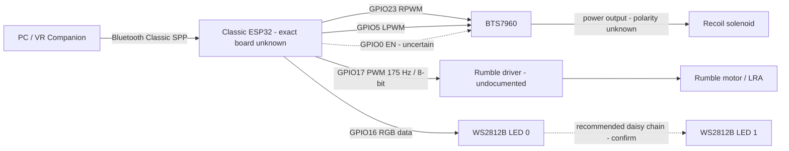

# Hardware and wiring

This document reconstructs the hardware implied by the recovered firmware. It is an archival wiring reference, not a statement that the recovered design is electrically safe or ready to power.

> **Safety warning:** do not connect or energize the rumble actuator or recoil solenoid until the actual board, power rails, driver wiring, grounding, current limits, and inductive-load protection have been verified independently.

## Evidence and confidence

The sources used are the firmware files in this repository, the validated `PROJECT_AUDIT.md`, and the repository README.

- **Confirmed by source** means a pin, constant, API call, or behavior appears in the recovered firmware.
- **Observed by audit** means the audit also inspected behavior of the recovered local BTS7960 library or companion material that is not published in this source-only repository.
- **Recommended** describes a rebuild practice, not recovered wiring.
- **To be confirmed on the physical prototype.** means the repository does not contain enough evidence to make the claim.

## System architecture

The reference firmware emulates a ForceTubeVR-style Bluetooth peripheral. A PC-side VR companion sends four-byte haptic commands over Bluetooth Classic SPP. The ESP32 decodes kick and rumble channels, drives two status LEDs, emits rumble PWM, and asks a BTS7960 driver to pulse the recoil actuator.

```text
PC / VR Companion
       │
       │ Bluetooth Classic SPP
       ▼
     ESP32
       │
       ├── Rumble PWM ──> undocumented power stage ──> Rumble motor / LRA
       │
       ├── BTS7960 motor driver
       │        │
       │        └── Recoil solenoid
       │
       └── WS2812B status LEDs ×2
```

The trigger experiment adds local controls and feedback:

```text
ESP32
 ├── Trigger switch
 ├── Profile button
 ├── Mode button
 ├── SSD1306 OLED
 ├── Buzzer
 ├── WS2812B LEDs ×2
 ├── Rumble output
 └── BTS7960 ──> Recoil solenoid
```

## Reference firmware pinout

Firmware: `variants/reference-leds-pwm-solenoid/Vr_gun_code_with_leds_pwm_solenoid_1_.ino`

| ESP32 GPIO | Function | Connected component | Signal | Confidence |
|---|---|---|---|---|
| GPIO17 | Rumble output | Rumble driver stage | PWM, 175 Hz, 8-bit | Confirmed by source |
| GPIO23 | `RPWM_PIN` | BTS7960 RPWM input | PWM/control through library | Confirmed by source |
| GPIO5 | `LPWM_PIN` | BTS7960 LPWM input | PWM/control through library | Confirmed by source |
| GPIO0 | BTS7960 constructor `EN` argument | BTS7960 enable wiring | Control | Source argument confirmed; physical wiring uncertain |
| GPIO16 | WS2812B data | Two addressable RGB LEDs | Digital data, `RGB` order | Confirmed by source |

No physical trigger input, OLED, profile button, mode button, or buzzer is present in the reference firmware.

### Important direction detail

The variable names label GPIO23 as RPWM and GPIO5 as LPWM. The audit of the recovered BTS7960 library found that `TurnLeft()` activates LPWM/GPIO5 and `TurnRight()` activates RPWM/GPIO23. The current kick sequence calls `TurnLeft()` first, so **GPIO5 is the output actually activated for the approximately 30 ms forward kick**, despite comments that describe the opposite direction.

## Trigger-experimental pinout

Firmware: `variants/trigger-experimental/Vr_gun_code_with_trigger.ino`

| ESP32 GPIO | Function | Connected component | Signal / code expectation | Confidence | Warning |
|---|---|---|---|---|---|
| GPIO17 | Rumble output | Rumble driver stage | PWM, 175 Hz, 8-bit | Confirmed by source | Driver stage is undocumented |
| GPIO23 | `RPWM_PIN` | BTS7960 RPWM | PWM/control through library | Confirmed by source | Direction behavior must be verified |
| GPIO5 | `LPWM_PIN` | BTS7960 LPWM | PWM/control through library | Confirmed by source | Current kick path uses LPWM |
| GPIO0 | BTS7960 constructor `EN` argument | BTS7960 enable wiring | Control | Source argument confirmed; physical wiring uncertain | ESP32 boot/strapping pin; do not treat as validated wiring |
| GPIO16 | WS2812B data | Two addressable RGB LEDs | Digital data, `RGB` order | Confirmed by source | LED supply and level compatibility are unknown |
| GPIO4 | Profile button | Momentary switch | `INPUT_PULLUP`, active LOW | Confirmed by source | Physical switch-to-ground wiring: To be confirmed on the physical prototype. |
| GPIO15 | Trigger | Trigger switch | `INPUT_PULLUP`, active LOW | Confirmed by source | GPIO15 is a strapping pin on common classic ESP32 designs |
| GPIO8 | Mode button | Momentary switch | `INPUT_PULLUP`, active LOW | Confirmed by source | Common ESP32-WROOM modules use GPIO8 for flash; likely unavailable |
| GPIO9 | Buzzer | Buzzer or sounder driver | `tone()` at 1 kHz/1.2 kHz for 100 ms | Confirmed by source | Common ESP32-WROOM modules use GPIO9 for flash; likely unavailable |
| Implicit | OLED I2C | 128×64 SSD1306 at `0x3C` | `Wire`, pins not specified | Confirmed by source | SDA/SCL pins and physical wiring are unknown |

GPIO8 and GPIO9 are problematic on many classic ESP32-WROOM modules because they are normally connected to SPI flash. GPIO15 can affect boot strapping. This pinout must be revised and verified before the trigger variant is connected to hardware.

The source configures all three switches with internal pull-ups and treats LOW as pressed. A switch between its GPIO and ground is therefore the logical wiring expected by the code, but the recovered repository does not confirm the physical switch wiring. **To be confirmed on the physical prototype.**

## PWM and timing summary

| Variant / output | GPIO | Firmware configuration | What is actually established |
|---|---:|---|---|
| Reference rumble | 17 | 175 Hz, 8-bit, duty 0–255 | Confirmed by `ledcAttach(GPIO17, 175, 8)` |
| Trigger rumble | 17 | 175 Hz, 8-bit, duty 0–255 | Confirmed by source |
| ArduinoISP/simple rumble | 17 | 175 Hz, 8-bit, duty 0–255 | Confirmed by source |
| Reference/trigger/simple solenoid | 5 and 23 | Command values 215–255; reverse request at 25% | BTS7960 library uses `analogWrite()`; real PWM frequency depends on the ESP32 core/library |
| Reference declared solenoid PWM | none attached | 20 kHz, channel 1, 8-bit constants | Constants exist but are unused; **20 kHz is not the demonstrated output frequency** |
| PoC rumble | 32 | 8 kHz, 8-bit, LEDC channel 1 | Confirmed by source; old ESP32 Core 2.x API |
| PoC kick | 33 | 60 Hz, 8-bit, LEDC channel 2 | Confirmed by source; downstream driver/actuator is unknown |

The reference, trigger, and ArduinoISP/simple kick paths apply `TurnLeft()` for approximately 30 ms. They then call `TurnRight()` and immediately call `Stop()` with no intentional reverse-pulse duration. The physical reverse effect is therefore not established.

## Components

### ESP32

The ESP32 is the main controller. It:

- exposes a Bluetooth Classic Serial Port Profile (SPP) device;
- receives ForceTubeVR-style packets (`0x2A`, `0xB0`, channel, intensity);
- maps channel `0x00` to recoil/kick and channel `0x01` to rumble;
- generates rumble PWM;
- controls the BTS7960 through the recovered library;
- updates two WS2812B status LEDs;
- in the trigger variant, reads three local switches and updates an OLED and buzzer.

The `BluetoothSerial` and SPP compile-time checks imply a **classic ESP32 with Bluetooth Classic support**. Do not assume ESP32-S2, ESP32-S3, or ESP32-C3 compatibility: their Bluetooth capabilities and SPP support are not equivalent to the classic ESP32 used by this code.

**Exact ESP32 board/module: to be confirmed.**

The logic supply voltage, regulator arrangement, USB/power input, and accessible GPIO header mapping are not documented. **To be confirmed on the physical prototype.**

### BTS7960 H-Bridge / high-current motor driver

The BTS7960 module is intended to isolate the ESP32 control logic from the high-current recoil actuator and to provide bidirectional output control.

| Interface | Role in this archive | Recovered evidence |
|---|---|---|
| RPWM | One direction/control input | ESP32 GPIO23, used by library `TurnRight()` |
| LPWM | Opposite direction/control input | ESP32 GPIO5, used by library `TurnLeft()` and the current kick path |
| EN | Driver enable | Firmware passes literal GPIO0 as the library EN argument |
| Logic supply | Powers the module input/interface side | Voltage and actual connection are not documented |
| Power supply | Supplies actuator current to the H-bridge | Voltage, current capacity, terminals, and wiring are not documented |
| Power output | Connects the H-bridge to the recoil actuator | Polarity and physical terminals are not documented |

The source comment says `EN pin tied to 5V, use 0`, but the audited recovered library configures the passed value as an output pin. The code and comment therefore disagree: passing `0` does **not** reliably mean “ignore EN.” GPIO0 is also a significant boot/strapping pin on classic ESP32 hardware.

Do not use GPIO0 as validated BTS7960 wiring. The module may expose separate enable pins, and the way those pins were joined or driven is not present in the repository. **To be confirmed on the physical prototype.**

Exact logic voltage, accepted input-high level, power-terminal names, enable topology, cooling, and current rating of the installed module: **To be confirmed on the physical prototype.**

### Recoil solenoid

The recoil solenoid produces the short mechanical kick. It is commanded through the BTS7960 rather than directly from the ESP32.

| Parameter | Value |
|---|---|
| Type | Solenoid / linear actuator |
| Supply voltage | To be confirmed on the physical prototype. |
| Current | To be confirmed on the physical prototype. |
| Coil resistance | To be confirmed on the physical prototype. |
| Exact model | To be confirmed on the physical prototype. |
| Driver | BTS7960 |
| Typical firmware kick duration | Approximately 30 ms |
| Requested PWM range | 215–255 from an 8-bit intensity mapping |
| Requested reverse level | 25% of kick value, followed immediately by `Stop()` |
| Direction control | LPWM/RPWM through the recovered library |

The solenoid must never be powered from an ESP32 GPIO or from a regulator not rated for its current. It needs a correctly sized actuator supply and power path. The repository does not establish whether the actuator is spring-return, bidirectional, or whether a reverse pulse is mechanically required. **To be confirmed on the physical prototype.**

### Rumble motor / LRA

Rumble is a continuous or intensity-controlled vibration effect distinct from the short recoil solenoid kick.

| Parameter | Reference/trigger/simple value |
|---|---|
| ESP32 signal | GPIO17 |
| Signal | PWM |
| Frequency | 175 Hz |
| Resolution | 8-bit |
| Duty range | 0–255 |
| Exact actuator type | To be confirmed on the physical prototype. |
| Supply voltage/current | To be confirmed on the physical prototype. |

The reference calls the actuator an LRA/Vibronics device, while the simplified variant comments refer to an Xbox 360 rumble motor. The exact actuator type cannot be resolved from the repository.

**Rumble driver stage is not documented in the recovered source and must be verified on the prototype.** An ESP32 GPIO may provide only a logic signal; an actuator drawing more than a few milliamps requires an appropriate transistor, MOSFET, driver IC, and inductive-load protection.

### WS2812B status LEDs

The three BTS7960-based variants define two WS2812B-compatible RGB LEDs on GPIO16. The reference and ArduinoISP/simple variants set FastLED global brightness to 50. The trigger variant does not call `FastLED.setBrightness()`, so brightness 50 must not be assumed for that variant.

| LED | Usage observed | Colors observed in reference/simple code |
|---|---|---|
| LED 0 | Bluetooth connection/status | Red when disconnected, blue when connected |
| LED 1 | Haptic status | Red for kick, blue for rumble, red/blue mixture (purple) when combined, black when idle |

The reference uses FastLED with `RGB` byte order; a `GRB` line is present only as a comment. The trigger variant uses LED 1 for kick/rumble while active and otherwise shows the selected profile color.

One GPIO controls an array of two addressable LEDs, which is consistent with a daisy chain. The standard recommended chain is:

```text
ESP32 GPIO16 ──> DIN LED 0
LED 0 DOUT ────> DIN LED 1
```

This is a **recommended interpretation**, not recovered physical wiring. LED order, connector direction, supply voltage, ground, data-level translation, series data resistor, and local decoupling: **To be confirmed on the physical prototype.**

### Trigger and buttons

The trigger experiment defines three active-low inputs with internal pull-ups:

- GPIO4: cycle profile;
- GPIO15: fire trigger;
- GPIO8: toggle semi-automatic/automatic mode.

The code expects a transition from HIGH to LOW. Switch type, contact rating, debounce hardware, connector, and physical wiring: **To be confirmed on the physical prototype.** GPIO8 and GPIO15 must be reassigned or proven safe for the exact module before use.

### OLED display

The trigger variant instantiates an Adafruit SSD1306 display with:

- resolution: 128×64;
- interface: I2C through `Wire`;
- address: `0x3C`;
- reset argument: `-1` (no dedicated reset GPIO in the constructor);
- displayed data: profile, semi/auto mode, and Bluetooth state.

SDA, SCL, supply voltage, ground, connector order, and exact display module: **To be confirmed on the physical prototype.** The source does not assign I2C pins, so do not assume GPIO21/GPIO22 without checking the selected board/core configuration.

### Buzzer

The trigger variant assigns GPIO9 as an output and calls:

- 1,000 Hz for 100 ms when the profile changes;
- 1,200 Hz for 100 ms when the fire mode changes.

Exact buzzer type, voltage, current, polarity, and whether a transistor driver is required: **To be confirmed on the physical prototype.** GPIO9 is likely unavailable on common ESP32-WROOM modules because it is commonly used by flash memory.

## Power architecture

The repository does not provide a schematic or confirmed voltage/current values. The conceptual separation should be:

```text
                  +--------------------+
                  |  Power supply      |
                  |  value(s) unknown  |
                  +---------+----------+
                            |
               +------------+-------------+
               |                          |
               v                          v
        Logic supply                Solenoid supply
           ESP32                      BTS7960
               |                          |
               |                          v
               |                      Solenoid
               |
               +------ WS2812B LEDs
               |
               +------ Rumble driver
                          |
                          v
                     Rumble motor / LRA
```

Design implications:

- ESP32 logic power and actuator power are different electrical responsibilities, even if a final design derives them from one upstream source.
- The solenoid must not be powered from an ESP32 GPIO.
- The rumble actuator must not be powered directly by a GPIO unless its measured current is within the GPIO limit—which is not established here.
- A common signal reference/ground may be required between ESP32 and external drivers. The exact grounding arrangement must be verified for the real driver modules and supplies.
- Check BTS7960 input-level compatibility with the ESP32 logic level.
- Size supplies, regulators, wiring, connectors, and PCB traces for measured steady-state, startup, stall, and pulse currents.
- Keep actuator-current returns from disturbing the ESP32 supply and ground reference.

Supply voltage, current capacity, rail sharing, grounding topology, and power connector pinout: **To be confirmed on the physical prototype.**

## Electrical protection and safety

### Observed in recovered prototype/code

- The reference sets GPIO17, GPIO23, and GPIO5 LOW before configuring the rumble PWM.
- The firmware limits the main forward kick command to an approximately 30 ms blocking interval.
- The reference intends a 500 ms rumble timeout, but its timestamp is refreshed continuously while rumble is active, so the timeout cannot expire normally.
- The trigger variant repeats the same broken timeout pattern.
- The ArduinoISP/simple variant records the timestamp only when a rumble packet arrives, so its 500 ms timeout is more credible.
- The code requests a reverse value, but immediately stops it; no reverse duration is established.
- No fuse, current sensor, emergency stop, flyback component, snubber, TVS, thermal sensor, or validated disconnect-safe state is documented.

Do not infer that any protection component is present merely because the BTS7960 module may offer internal protections. The exact module and surrounding circuit are unknown.

### Recommended before rebuilding

- Add a correctly rated fuse close to the actuator supply source.
- Size conductors, PCB traces, terminals, and connectors for measured peak and stall current.
- Add local bulk and high-frequency decoupling at the logic and power loads.
- Verify inductive-transient handling with the actual BTS7960 module and actuator.
- Select a diode, snubber, TVS, or other clamp only after confirming whether the actuator is driven unidirectionally or bidirectionally; a simple diode can conflict with H-bridge reversal.
- Use a low-impedance, deliberate common-ground strategy where required, while keeping actuator-current paths away from logic returns.
- Provide a stable ESP32 supply that tolerates actuator transients without brownout or unintended boot-mode entry.
- Use connectors with appropriate current, voltage, polarization, retention, and touch-safety ratings.
- Force solenoid and rumble outputs to a verified OFF state on boot, Bluetooth disconnect, malformed/partial packets, timeout, and software fault.
- Enforce maximum kick duration, maximum rumble duration, minimum interval between kicks, and maximum sustained firing cadence.
- Consider an independent hardware enable or emergency-stop path that does not depend solely on firmware.
- Test first with LEDs only, then a current-limited dummy load, then rumble, and only then the solenoid behind a protected supply.

Component values and protection topology must be selected from measurements and datasheets for the physical parts. **To be confirmed on the physical prototype.**

## Reference wiring diagram

Confirmed signal assignments are shown with solid labels. `?` marks physical wiring not established by the repository.

```text
                        +----------------------+
                        |  Classic ESP32 (?)   |
                        |                      |
 Bluetooth SPP <------> |                      |
                        | GPIO17 ---- PWM -----+----> Rumble driver (?) ---> Rumble/LRA (?)
                        |                      |
                        | GPIO23 --------------+----> BTS7960 RPWM
                        | GPIO5 ---------------+----> BTS7960 LPWM
                        | GPIO0 ---------------+----> BTS7960 EN (?)
                        |                      |
                        | GPIO16 --------------+----> WS2812B LED 0 ---> LED 1 (?)
                        +----------------------+

                                           +-----------------------+
 Actuator power supply (?) --------------->| BTS7960               |
 Logic supply / ground (?) --------------->| logic interface       |
 ESP32 GPIO23 ---------------------------->| RPWM                  |
 ESP32 GPIO5 ----------------------------->| LPWM                  |
 ESP32 GPIO0 ----------------------------->| EN (?)                |
                                           |                       |
                                           | power OUT+ / OUT- (?) |
                                           +-----------+-----------+
                                                       |
                                                       v
                                                RECOIL SOLENOID (?)
```

The drawing does not establish voltage, current, connector pins, ground routing, BTS7960 enable topology, or actuator polarity.

## Mermaid architecture



## Known issues and rebuild blockers

1. Exact ESP32 board/module and pin breakout are unknown.
2. GPIO0 is passed as BTS7960 EN even though it is a boot/strapping pin and the comment claims EN is tied to 5 V.
3. The comments and actual `TurnLeft()`/`TurnRight()` pin behavior disagree.
4. The declared 20 kHz solenoid PWM configuration is unused; actual library PWM behavior depends on the selected ESP32 core.
5. The requested reverse kick has no deliberate duration before `Stop()`.
6. The audited library `Stop()` behavior is ambiguous because it writes `HIGH` through `analogWrite()` on RPWM rather than an explicit zero.
7. Reference and trigger rumble timeouts are ineffective; rumble can remain active after a lost command.
8. The reference accepts any nonzero `readBytes()` count rather than requiring all four bytes. Trigger and ArduinoISP/simple do require exactly four bytes.
9. Trigger GPIO8/GPIO9 are likely unusable on common ESP32-WROOM modules; GPIO15 requires boot-strapping review.
10. Trigger OLED failure is not stored as state, yet later display updates still run.
11. Trigger button debounce, kick, and semi/auto cadence use blocking delays.
12. No confirmed power schematic, actuator rating, rumble driver, protection network, grounding plan, or emergency stop exists in the repository.
13. The PoC uses old ESP32 LEDC APIs and its neighboring bHaptics/SenseShift source has missing dependencies.

No firmware correction is made by this documentation.

## Physical confirmation checklist

The following information remains unknown and must be recorded from the real prototype before rebuilding:

- exact ESP32 board/module, revision, pin labels, and installed ESP32 core compatibility;
- actual availability and boot behavior of GPIO0, GPIO5, GPIO8, GPIO9, and GPIO15;
- BTS7960 module model, terminal labels, genuine/current rating, cooling, RPWM/LPWM polarity, and EN wiring;
- logic-supply voltage and connection for ESP32, BTS7960 interface, OLED, LEDs, and buzzer;
- actuator-supply voltage, peak/stall current, fuse rating, connector, and wire gauge;
- solenoid model, coil resistance, polarity, mechanical return method, safe pulse duration, and safe cadence;
- rumble actuator type, voltage/current, mounting, and transistor/MOSFET/driver circuit;
- WS2812B module type, power voltage, physical LED order, data direction, level shifting, resistor, and decoupling;
- OLED module, SDA/SCL GPIOs, connector pinout, and supply voltage;
- trigger/profile/mode switch wiring, connector pinout, and physical debounce behavior;
- buzzer type, polarity, drive-current requirement, and whether a transistor is fitted;
- common-ground topology, power-return routing, inductive clamp/protection, bulk capacitance, and emergency-stop path.

For every unchecked item above: **To be confirmed on the physical prototype.**
