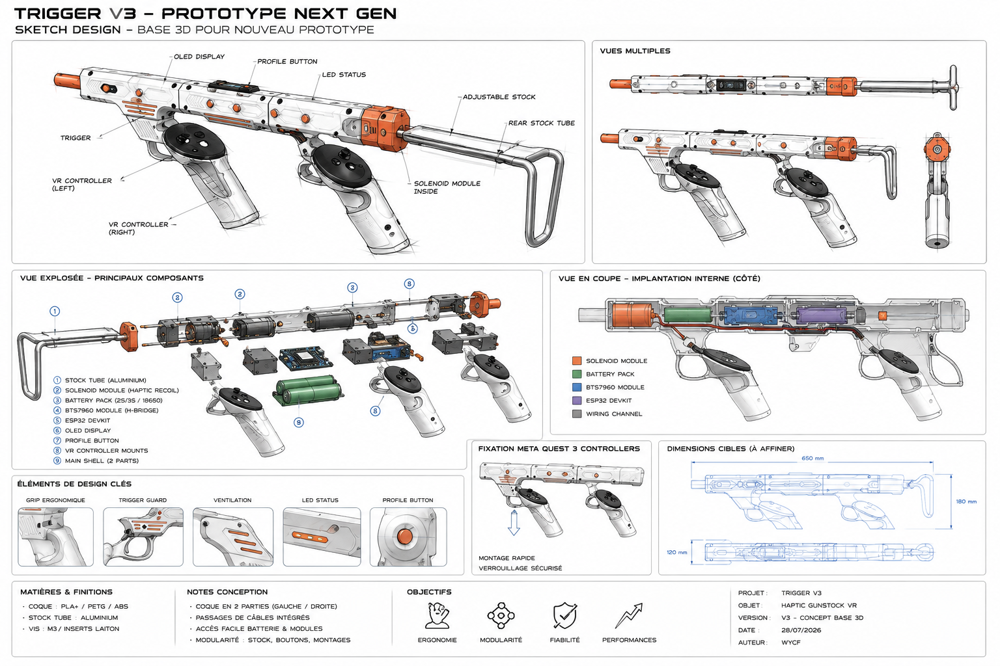

# Trigger V3 — Design Idea



> Cette page décrit une direction de conception mécanique pour le futur prototype Trigger V3.  
> Le concept visuel sert de base de travail pour Fusion 360 / CAO et ne représente pas encore les dimensions mécaniques finales.

## Objectif

Le futur gunstock doit pouvoir :

- accueillir proprement l'électronique Trigger V3 ;
- recevoir les deux contrôleurs Meta Quest 3 ;
- conserver l'accès aux boutons, joysticks et gâchettes des contrôleurs ;
- intégrer le système de recul à solénoïde ;
- intégrer les moteurs rumble ;
- intégrer l'ESP32 et le BTS7960 ;
- intégrer l'OLED et le bouton PROFILE ;
- permettre l'accès à la batterie ;
- rester démontable et facilement modifiable ;
- pouvoir être imprimé en plusieurs pièces sur une imprimante 3D standard ;
- conserver un style proche du concept visuel présenté ci-dessus.

---

## Philosophie générale du design

Il est préférable de ne pas concevoir une grosse coque monobloc.

Le prototype devrait être construit autour d'une **colonne vertébrale interne rigide**, sur laquelle viennent se fixer différents modules imprimés.

Architecture proposée :

```text
TRIGGER V3
│
├── Structure centrale / Main Spine
│
├── Coque gauche
├── Coque droite
│
├── Support contrôleur avant
├── Support contrôleur arrière
│
├── Module OLED
├── Bouton PROFILE
├── Plateau ESP32
├── Plateau BTS7960
├── Module solénoïde
├── Module batterie
└── Crosse arrière
```

Cette approche permet de modifier une seule partie du prototype sans devoir redessiner l'ensemble du gunstock.

---

## Dimensions de départ

Ces dimensions ne sont pas définitives. Elles servent uniquement de base pour démarrer le modèle paramétrique dans Fusion 360.

| Élément | Dimension indicative |
|---|---:|
| Longueur corps principal | 380 à 430 mm |
| Largeur extérieure | 45 à 55 mm |
| Hauteur du corps | 55 à 65 mm |
| Épaisseur coque | 2,5 à 3 mm |
| Cloisons internes | 2,5 à 3 mm |
| Canal de câbles minimum | 12 × 8 mm |
| Module OLED | environ 65 × 35 × 18 mm |
| Compartiment ESP32 | environ 75 × 45 × 25 mm |
| Compartiment BTS7960 | environ 65 × 55 × 30 mm |
| Déplacement possible des supports Quest 3 | 50 à 80 mm |
| Longueur crosse | environ 160 à 230 mm |

Toutes ces valeurs devront être corrigées après mesure réelle des composants.

---

## Structure centrale

Le cœur mécanique du prototype pourrait être une poutre centrale d'environ :

```text
Largeur : 35 à 40 mm
Hauteur : à définir
Longueur : environ 400 mm
```

Deux solutions sont possibles.

### Solution 1 — structure totalement imprimée

Le squelette interne est imprimé en PETG, ABS ou ASA.

Avantages :

- fabrication simple ;
- très facile à modifier ;
- pas d'usinage métallique.

### Solution 2 — profilé aluminium interne

Une partie de la colonne vertébrale peut utiliser un profilé aluminium rectangulaire.

Cette solution est particulièrement intéressante pour le système à recul car le solénoïde produit des efforts mécaniques répétés.

Le profilé pourrait servir de référence mécanique pour :

- le solénoïde ;
- les supports Quest 3 ;
- la crosse ;
- les différentes parties de la coque.

La coque imprimée aurait alors surtout un rôle esthétique, ergonomique et de protection électronique.

---

## Module solénoïde

Le solénoïde doit être placé autant que possible dans l'axe longitudinal du gunstock afin d'éviter qu'une impulsion génère une rotation ou une torsion importante.

```text
                         AXE DU RECUL
                              │
                              ▼

 ──────────────────────────────────────────────
                 [ SOLÉNOÏDE ]
 ──────────────────────────────────────────────
```

Le support du solénoïde devrait être une pièce indépendante et démontable.

Des éléments TPU peuvent éventuellement être utilisés pour réduire certaines vibrations transmises à l'électronique tout en conservant une bonne sensation de recul.

Le module doit rester facilement accessible pour :

- remplacement ;
- entretien ;
- modification du mécanisme ;
- réglage mécanique.

---

## Module BTS7960

Le BTS7960 devrait être installé relativement près du solénoïde afin d'éviter des câbles de puissance inutilement longs.

Prévoir :

- espace autour du module ;
- ventilation ;
- accès aux borniers ;
- fixation M3 ;
- chemin dédié pour les câbles de puissance.

Une séparation physique entre puissance et signaux est recommandée.

```text
CÔTÉ PUISSANCE
────────────────────
Batterie
BTS7960
Solénoïde
Moteurs rumble

        │
        │ structure centrale
        │

CÔTÉ LOGIQUE
────────────────────
ESP32
OLED
Bouton PROFILE
LED
Buzzer
```

---

## ESP32

L'ESP32 devrait être placé dans la zone centrale du gunstock, idéalement sous ou derrière le module OLED.

Il pourrait être monté sur un petit plateau démontable comportant :

- quatre entretoises ;
- vis M3 ;
- accès USB ;
- espace autour des connecteurs ;
- possibilité de sortir la carte sans démonter tout le prototype.

L'accès USB est particulièrement important pendant le développement du firmware.

---

## OLED

L'écran OLED doit être placé sur le dessus du gunstock.

Une légère inclinaison vers l'utilisateur est préférable.

Angle de départ recommandé :

```text
10° à 20°
```

Le logement OLED doit permettre le remplacement du module sans ouvrir toute la coque.

---

## Bouton PROFILE

Le bouton PROFILE doit être proche de l'OLED, accessible au pouce sans favoriser les pressions accidentelles.

Fonction cible :

```text
Appui court
→ profil suivant

Appui long ~1 s
→ HAPTIC_ONLY ↔ TRIGGER_FALLBACK
```

Il ne faut donc pas prévoir de bouton MODE séparé dans la conception mécanique finale.

---

## Supports Meta Quest 3

Les contrôleurs Quest 3 devraient être installés dans des berceaux ouverts.

Éviter de recouvrir inutilement :

- joystick ;
- boutons ;
- gâchette ;
- grip ;
- surfaces utiles au tracking.

Les deux supports devraient être démontables et idéalement réglables longitudinalement.

Course indicative :

```text
50 à 80 mm
```

Cela pourrait utiliser :

- un rail imprimé ;
- une queue d'aronde ;
- une rainure en T ;
- un rail type Picatinny adapté ;
- une glissière propriétaire simple.

---

## Coque principale

La coque devrait être divisée en deux demi-coquilles gauche/droite.

Avantages :

- assemblage simple ;
- maintenance facile ;
- accès à l'électronique ;
- meilleure impression 3D.

Épaisseur cible initiale :

```text
2,5 à 3 mm
```

Pour les zones démontées fréquemment, utiliser de préférence des inserts filetés laiton M3.

---

## Batterie

La batterie pourrait être placée dans la zone arrière.

Cette position apporte deux avantages :

1. elle équilibre le poids des composants avant ;
2. elle facilite la création d'un module extractible.

Le compartiment batterie doit être dimensionné après sélection définitive du pack utilisé.

---

## Crosse

La crosse pourrait être une pièce indépendante utilisant :

- tube aluminium ;
- tige métallique ;
- profilé ;
- pièce imprimée renforcée.

Une crosse réglable permettrait d'adapter la longueur du gunstock à l'utilisateur.

---

## Passage interne des câbles

Il faut prévoir les passages de câbles dès le début du modèle 3D.

Minimum proposé :

```text
12 × 8 mm
```

Le corps peut avoir deux chemins distincts :

```text
CANAL A — puissance
Batterie
BTS7960
Solénoïde
Rumble

CANAL B — signaux
ESP32
OLED
PROFILE
LED
Buzzer
```

Éviter que les câbles soient simplement coincés entre les deux demi-coquilles.

---

## Architecture mécanique proposée

```text
                   OLED
                    │
                    ▼
 ┌──────────────────────────────────────────────┐
 │                                              │
 │ ESP32        CÂBLES            BTS7960       │
 │                                              │
 │                         SOLÉNOÏDE ───────►   │
 │                                              │
 └──────────────────────────────────────────────┘
         │                          │
         ▼                          ▼
    QUEST 3 AVANT              QUEST 3 ARRIÈRE

                                     │
                                     ▼
                                  BATTERIE
                                     │
                                     ▼
                                   CROSSE
```

L'emplacement exact des modules pourra évoluer après mesure réelle et étude de l'équilibrage.

---

## Structure Fusion 360 recommandée

Le projet Fusion 360 devrait être organisé en composants indépendants :

```text
TriggerV3_Master
│
├── Main_Spine
├── Left_Shell
├── Right_Shell
├── Front_Controller_Mount
├── Rear_Controller_Mount
├── ESP32_Tray
├── BTS7960_Tray
├── OLED_Module
├── Profile_Button_Housing
├── Solenoid_Carriage
├── Battery_Cartridge
└── Rear_Stock
```

Ne pas modéliser tout le gunstock comme un seul Body Fusion 360.

---

## Paramètres Fusion 360

Créer dès le début des User Parameters.

Valeurs initiales :

```text
BODY_LENGTH      = 420 mm
BODY_WIDTH       = 50 mm
BODY_HEIGHT      = 60 mm

SHELL_THICKNESS  = 3 mm

FRONT_MOUNT_POS  = 105 mm
REAR_MOUNT_POS   = 285 mm

OLED_POS         = 200 mm

WIRE_CHANNEL_W   = 12 mm
WIRE_CHANNEL_H   = 8 mm

SCREW_DIAMETER   = 3.2 mm
```

Les dimensions des compartiments seront ajoutées après mesure réelle des composants.

---

## Ordre recommandé de modélisation

1. mesurer tous les composants ;
2. créer leurs volumes simplifiés dans Fusion 360 ;
3. positionner les deux contrôleurs Quest 3 ;
4. créer la structure centrale ;
5. positionner le solénoïde ;
6. positionner la batterie ;
7. placer ESP32 et BTS7960 ;
8. créer les passages de câbles ;
9. créer les supports Quest 3 ;
10. créer les deux demi-coquilles ;
11. ajouter OLED et bouton PROFILE ;
12. valider ergonomie et équilibrage ;
13. ajouter seulement ensuite les détails esthétiques.

---

## Première version mécanique

La première version 3D ne doit pas chercher à reproduire immédiatement l'apparence finale.

Un prototype mécanique simple est préférable pour valider :

- ergonomie ;
- poids ;
- équilibre ;
- recul ;
- position des contrôleurs ;
- accessibilité de l'électronique ;
- résistance mécanique.

Une fois ces points validés, une coque esthétique pourra être construite autour.

---

## Style extérieur cible

Après validation mécanique, le design extérieur pourra reprendre le style du concept :

- surfaces blanches / grises ;
- inserts orange ;
- panneaux techniques ;
- vis visibles ;
- lignes géométriques ;
- petites ouvertures de ventilation ;
- OLED intégré dans le dessus ;
- corps relativement fin ;
- crosse métallique ou hybride métal / impression 3D ;
- modules clairement séparés.

La priorité reste :

```text
MÉCANIQUE
   ↓
ÉLECTRONIQUE
   ↓
ERGONOMIE
   ↓
FIABILITÉ
   ↓
ESTHÉTIQUE
```

---

## Prochaine étape

Avant de démarrer le modèle Fusion 360 définitif, relever précisément les dimensions de :

- ESP32 + shield DIY ;
- BTS7960 ;
- solénoïde ;
- OLED SSD1306 ;
- batterie ;
- buck converter ;
- buzzer ;
- moteurs rumble ;
- bouton PROFILE ;
- contrôleur Meta Quest 3 ;
- connecteurs et câbles importants.

Ces mesures permettront de créer dans Fusion 360 des **dummy components** représentant exactement l'espace occupé par chaque élément.

Le corps du gunstock sera ensuite construit autour de ces volumes plutôt que l'inverse.
