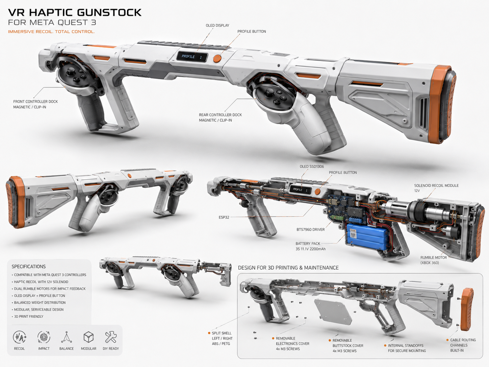

# Trigger V3



> Concept visuel du futur gunstock VR haptique. Cette illustration sert de référence de design et ne représente pas encore les dimensions mécaniques finales.

Trigger V3 is an isolated implementation derived from the hardware-tested working reference:

`../reference-leds-pwm-solenoid/Vr_gun_code_with_leds_pwm_solenoid_1_.ino`

Trigger V3 was bootstrapped from the validated Trigger V2 state at `a12cb55fb74f9841d71e40638f5904380e004428`. The initial V3 directory bootstrap commit is `154a5cb48b905daf665866fdc142a089f3674c4a`.

The historical flash dump is not a development input and is not part of this repository. **A full flash backup of the known-good prototype is kept locally by the owner for emergency restoration on the original ESP32 board.**

## Continuity documentation

Before wiring new Trigger V3 hardware or asking a future AI session to modify the firmware, use these documents:

- [`PROJECT_STATE.md`](PROJECT_STATE.md) — authoritative technical state, decisions, validated behavior, known risks, and current development boundary.
- [`SIMPLIFIED_CONTROLS_WIRING.md`](SIMPLIFIED_CONTROLS_WIRING.md) — **validated two-button target**: GPIO13 Trigger + GPIO14 PROFILE, corrected DIY-shield mapping, OLED wiring, and SAFE validation status.
- [`DESIGN_IDEA.md`](DESIGN_IDEA.md) — concept mécanique et base de conception 3D pour le futur gunstock Trigger V3.
- [`VALIDATION_LOG.md`](VALIDATION_LOG.md) — chronological record of what was actually tested on the real prototype, including the abandoned Wi-Fi experiment and the successful SAFE/COMPAT tests.
- [`HARDWARE_VALIDATION.md`](HARDWARE_VALIDATION.md) — recommended incremental wiring order, SAFE-first test procedure, electrical cautions, troubleshooting tree, and tuning method.
- [`XBOX_RUMBLE_WIRING.md`](XBOX_RUMBLE_WIRING.md) — Xbox 360 rumble motor / IRLZ44N wiring reconstruction and hardware notes.
- [`AI_HANDOFF_PROMPT.md`](AI_HANDOFF_PROMPT.md) — copy/paste recovery prompt for a future AI model so it can resume diagnosis without rebuilding the project context from zero.
- [`TEST_PLAN.md`](TEST_PLAN.md) — detailed verification matrix.
- [`BOOT_HEALTH.md`](BOOT_HEALTH.md) — exact meaning of boot-health states and optional-device detection rules.

> **Two-button design decision:** the final control layout uses GPIO13 as the physical Trigger and GPIO14 as the single auxiliary PROFILE button. PROFILE short press advances the weapon profile; PROFILE long press (~1 s) toggles `HAPTIC_ONLY` / `TRIGGER_FALLBACK`. GPIO4 is unused. This migration has been built, flashed, and physically exercised in SAFE for OLED, profile switching, mode switching, and trigger input detection.

The project is currently in the **wiring -> progressive validation -> tuning** phase. The software architecture should not be rewritten unless new physical evidence demonstrates a real defect.

## Runtime scope

**TRIGGER V3 HAS NO WIFI.**

**Trigger V3 has no Wi-Fi functionality.**

**External runtime communication: Bluetooth Classic SPP / ForceTube only.** Bluetooth Classic SPP is the exclusive external runtime communication channel. Serial is a local development channel; there is no network provisioning, network credential storage, HTTP service, dashboard, or remote hardware command surface.

The runtime path is:

```text
Quest 3 or Android test application
              |
      Bluetooth Classic SPP
              |
        ForceTube parser
              |
       HapticController
          |         |
      Rumble     BTS7960 -> solenoid

GPIO13 trigger -> TRIGGER_FALLBACK -> HapticController
```

## Hardware-tested baseline preserved

| Item | Exact value |
|---|---|
| Bluetooth name | `ForceTubeVR 1187883197` |
| Packet | 4 bytes: `0x2A 0xB0 channel intensity` |
| Channel `0` | KICK |
| Channel `1` | RUMBLE |
| Rumble | GPIO17, 175 Hz, 8 bit |
| BTS7960 RPWM | GPIO23 |
| BTS7960 LPWM | GPIO5 |
| WS2812 data | GPIO16, 2 LEDs, brightness 50 |
| Solenoid mapped PWM | 215 minimum, 255 maximum |
| Forward duration | 30 ms |
| Reverse strength | 25% |
| Reverse duration | 2 ms, physically validated on the 1564B + BTS7960 prototype |
| Rumble watchdog | 500 ms after the last valid RUMBLE command |

ForceTube KICK uses the received intensity unchanged before the existing 215–255 solenoid mapping. Local trigger KICK uses the selected profile. Both sources request output through the same `HapticController`, which owns arming, build gating, active-cycle overlap protection, pulse timing, rumble timing, and safe stop.

The four-byte streaming parser accepts partial and adjacent packets, ignores invalid bytes, and resynchronizes on the next `0x2A 0xB0` header without changing the protocol.

## Direct BTS7960 behavior

Trigger V3 does not instantiate the recovered BTS7960 library and does not use GPIO0.

| Operation | Direct sequence |
|---|---|
| Forward/kick | GPIO23/RPWM = `0`, wait 100 µs, GPIO5/LPWM = mapped PWM |
| Reverse | GPIO5/LPWM = `0`, wait 100 µs, GPIO23/RPWM = PWM |
| Stop | GPIO5/LPWM = `0`, GPIO23/RPWM = `0` |

`TurnLeft` and `TurnRight` were verified against the locally recovered Luis Llamas BTS7960 1.0.0 implementation. Its historical `Stop()` produced `(LPWM, RPWM) = (0, 1)`; Trigger V3 deliberately uses the idle state `(0, 0)`. The historical three-pin constructor with `BTS7960 motor(0, ...)` configured and could write GPIO0; the direct controller avoids that side effect.

## Optional Trigger V3 hardware

Current two-button layout:

| Function | GPIO | Current behavior |
|---|---:|---|
| Profile button | 14 | short = next profile; long ~1 s = HAPTIC/TRIG |
| Physical trigger | 13 | `INPUT_PULLUP`; profile behavior only in fallback |
| GPIO4 | — | unused / free |
| Buzzer | 27 | output starts LOW; optional |
| OLED SDA | 21 | I2C |
| OLED SCL | 22 | I2C |

Trigger and Profile are active LOW, debounced for 35 ms, and use the boot-release guard. A held-low input at boot is ignored until it is first released.

The SSD1306 128×64 display is probed at I2C address `0x3C` on SDA21/SCL22 at 400 kHz with a 20 ms bus timeout. The real prototype has confirmed `I2C ACK; UI initialized`.

The 100 ms dirty-only live UI has two views. The manual view shows profile, real `ProfileBehavior`, KICK/RUMBLE, RATE, validated reverse settings, Bluetooth state, and `HAPT`/`TRIG`. Every complete ForceTube command selects `FT LIVE` for 1,500 ms without claiming a weapon identity.

SAFE validation on 25/08/2026 confirmed the complete profile loop, GPIO14 short/long behavior, OLED operation, Bluetooth operation, and GPIO13 PRESS/RELEASE detection. A local GPIO13 kick request while actually in `TRIGGER_FALLBACK` remains the next SAFE validation step.

The optional buzzer gives 60 ms nonblocking feedback for profile and operating-mode changes. Its physical presence is not yet validated.

## Operating mode and profile behaviors

- `HAPTIC_ONLY` is selected at every boot. ForceTube KICK and RUMBLE work normally; GPIO13 never generates a local action.
- `TRIGGER_FALLBACK` keeps ForceTube unchanged and allows GPIO13 to run the selected profile.
- `Single` requests one local kick on press and never repeats while held.
- `Auto` requests immediately, then repeats nonblockingly with `millis()` and the profile's `autoRepeatMs`.
- `ChargeRelease` provides a generic discrete rumble ramp and a configurable release order.

**Current two-button firmware:** GPIO14 short press advances the catalog; GPIO14 long press (~1 s) toggles `HAPTIC_ONLY` / `TRIGGER_FALLBACK`; GPIO13 remains the physical trigger; GPIO4 is unused.

SAFE hardware validation on 25/08/2026 confirmed OLED detection, the complete profile loop, GPIO14 short/long behavior, and GPIO13 PRESS/RELEASE input detection. A local GPIO13 kick request while actually in `TRIGGER_FALLBACK` remains the next SAFE validation step.

Changing operating mode or profile cancels the active local cycle. The trigger must be released and pressed again before local fire can resume.

## Local profiles

[HapticProfiles.h](include/HapticProfiles.h) is the single weapon catalog. A future weapon using `Single`, `Auto`, or `ChargeRelease` is added by editing only this file and rebuilding.

| Profile | Behavior | Kick | AUTO repeat | Charge configuration | Color |
|---|---|---:|---:|---|---|
| `PISTOL` | SINGLE | 230 | 0 | disabled | 0,0,255 |
| `SNIPER` | SINGLE | 255 | 0 | disabled | 0,128,0 |
| `M16` | AUTO | 240 | 150 ms | disabled | 255,0,0 |
| `P90` | AUTO | 220 | 150 ms | disabled | 255,255,0 |
| `LASER` | CHARGE_RELEASE | 255 | 0 | 0→255, 20 steps, duration 0, order Uncalibrated | 255,255,255 |

The inherited 150 ms M16/P90 cadence is temporary and still requires physical tuning. The APK exposed exactly 20 LASER charge levels, but the total charge duration and physical release order were not measured. Consequently LASER local physical execution is deliberately disabled: with `chargeDurationMs=0` and `ChargeReleaseOrder::Uncalibrated`, it produces telemetry only and no nonzero local actuator call. The ForceTube/Bluetooth path remains unchanged.

## Safe and compat environments

- `trigger-v3-safe` defines `TRIGGER_V3_ACTUATORS_ENABLED=0`. Boot, Bluetooth, parsing, trigger logic, buttons, profiles, modes, OLED, buzzer, LEDs, and diagnostics operate, but all nonzero kick and rumble requests are inhibited.
- `trigger-v3-compat` defines `TRIGGER_V3_ACTUATORS_ENABLED=1`. It enables the historical GPIO17/GPIO23/GPIO5 output path while keeping all new peripherals optional.

There is one actuator gate. `HapticController::setArmed()` combines the requested armed state with the compile-time gate and successful PWM initialization. Bluetooth commands and every configured local profile action call this same controller; none writes GPIO17, GPIO23, or GPIO5 directly. Disconnect stops all outputs, resets the partial parser state, and invalidates the local cycle.

## Boot health and diagnostics

`BOOT_HEALTH.md` defines honest `DETECTED`, `CONFIGURED`, `RESERVED`, `NOT DETECTED`, and `ERROR` classifications for the configured V3 subsystems: WS2812, Trigger, Profile, Buzzer, I2C, OLED, Rumble, BTS7960, Solenoid, Bluetooth SPP, and ForceTube.

Lightweight Serial telemetry includes:

```text
[BT] ready name=ForceTubeVR 1187883197
[BT] connected
[BT] disconnected; outputs stopped
[FT] KICK intensity=230 result=ACCEPTED
[FT] RUMBLE intensity=80 result=ACCEPTED
[TRIGGER] pressed mode=TRIGGER_FALLBACK profile=PISTOL behavior=SINGLE
[TRIGGER] released
[MODE] HAPTIC_ONLY
[PROFILE] PISTOL behavior=SINGLE kick=230
[SAFE] actuator request blocked source=TRIGGER
```

Rumble logging is rate-limited to intensity changes and at most once per second while unchanged and active. Set `TRIGGER_V3_SERIAL_TELEMETRY=0` to compile out the extra runtime telemetry; boot-health and initialization errors remain.

## Build and partition

The target remains classic `esp32dev` on the pinned PioArduino/Espressif32 release and Arduino Core ESP32 3.3.11. The BluetoothSerial future-deprecation warning is accepted for this classic ESP32 target; there is no BLE or core migration in this phase.

The current `min_spiffs.csv` layout is intentionally unchanged: two 1,966,080-byte OTA application slots remain available. OTA is retained, `huge_app` is not used, and the partition layout will not be changed silently if future code grows. The physical prototype has already confirmed ESP32-D0WD-V3 and 4 MB flash.

```powershell
platformio run -d variants/trigger-v3 -e trigger-v3-safe
platformio run -d variants/trigger-v3 -e trigger-v3-compat
```

Building does not authorize flashing or energizing actuators. Follow `TEST_PLAN.md`; software completion is not physical validation.
