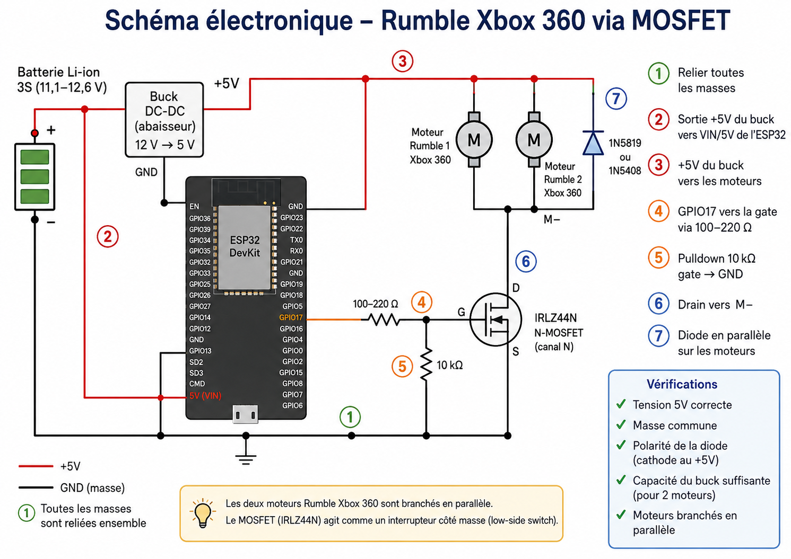

# Xbox 360 Rumble Motor Wiring — ESP32 + IRLZ44N

## 1. Purpose

This document reconstructs the rumble wiring used by the prototype:

- ESP32;
- two Xbox 360 rumble motors;
- one IRLZ44N N-channel MOSFET stage;
- one 12 V to 5 V buck converter.

Evidence is labelled deliberately:

- **CONFIRMED**: supported by the current firmware, recovered source, or a reported physical observation.
- **PROBABLE / RECONSTRUCTED**: the most likely interpretation of the available history, but not proven wire by wire.
- **TO VERIFY ON HARDWARE**: must be checked on the physical prototype before rewiring or powering it.

The written wiring and safety notes in this document are authoritative. The generated illustrations are visual aids and contain labels or routing that still require verification.

## 2. Confirmed / recovered hardware context

| Item | Evidence status | Current understanding |
|---|---|---|
| Controller | **CONFIRMED** | Classic ESP32 development board. |
| Rumble firmware output | **CONFIRMED** | GPIO17 is used by the historical Trigger V2 firmware and the current Trigger V3 firmware. |
| Rumble actuators | **CONFIRMED / recovered history** | Two motors taken from an Xbox 360 controller. |
| Rumble switch | **CONFIRMED / recovered history** | IRLZ44N N-channel MOSFET. |
| Battery | **CONFIRMED / recovered history** | Rechargeable 3S3P 18650 pack, about 11.1 V nominal and 12.6 V fully charged. |
| Low-voltage supply | **CONFIRMED / recovered history** | Buck converter from the battery rail to 5 V. |
| Motor supply | **PROBABLE / RECONSTRUCTED** | The recovered history indicates that the 5 V buck rail powered the Xbox rumble section. Measure it before reconnecting. |
| Ground reference | **REQUIRED; TO VERIFY ON HARDWARE** | ESP32 GND, buck GND, battery negative reference, and IRLZ44N Source must share a common reference. |
| Two-motor connection | **PROBABLE / RECONSTRUCTED** | The two motors were most likely connected in parallel. Confirm the physical wiring. |

Do not connect the 3S battery rail directly to an ESP32 5V or VIN pin unless the exact board documentation explicitly permits that voltage. The reconstructed connection in this document uses the regulated 5 V buck output.

## 3. Important distinction: rumble vs solenoid

| | Rumble subsystem | Solenoid subsystem |
|---|---|---|
| Firmware output | GPIO17 | GPIO5 / GPIO23 |
| Power switch / driver | IRLZ44N N-MOSFET | BTS7960 H-bridge |
| Load | Two Xbox 360 rumble motors | 1564B / 65 N solenoid used on the prototype |
| Reconstructed supply | 5 V buck rail | 3S battery rail |
| Inductive protection | Conventional motor flyback diode is probable, but its exact part is not confirmed | 1.5KE24CA bidirectional TVS |
| Control method | Low-side PWM switching | Forward and short reverse drive |

The **1.5KE24CA is a bidirectional TVS**, not a Schottky diode. It belongs to the BTS7960/solenoid protection circuit. It must not be documented or wired as the Xbox motor flyback diode.

## 4. Likely reconstructed rumble wiring

The most likely topology is an IRLZ44N low-side switch:

~~~text
5 V motor rail
    |
    +---- Motor 1 +
    |
    +---- Motor 2 +

Motor 1 - ----+
              |
Motor 2 - ----+---- IRLZ44N Drain

IRLZ44N Source ---- GND

ESP32 GPIO17
    |
series gate resistor
    |
IRLZ44N Gate

IRLZ44N Gate
    |
gate-to-GND pull-down resistor
    |
GND
~~~

The two motors in parallel are the most probable reconstruction, but their exact physical parallel/series wiring remains **TO VERIFY ON HARDWARE** if no definitive photo or continuity measurement is available.

All grounds must share the same reference:

~~~text
ESP32 GND
Buck GND
Battery negative reference
IRLZ44N Source
~~~

## 5. Gate resistor and pull-down resistor

The **series gate resistor** sits between GPIO17 and the IRLZ44N Gate. It limits the brief gate charge/discharge current, reduces ringing, and helps isolate the ESP32 output from switching noise.

The **gate-to-GND pull-down resistor** keeps the MOSFET off while the ESP32 is booting, reset, disconnected, or not actively driving GPIO17.

Typical design examples are:

- series gate resistor: a few tens to a few hundreds of ohms;
- gate pull-down: a few kilo-ohms to a few tens of kilo-ohms.

These are **example / typical values, not confirmed prototype values**. The illustrations show 100-220 ohm and 10 kohm, but the repository contains no independent recovered evidence that those exact values are installed. Read the resistor markings or measure the physical parts before relying on them.

## 6. Flyback diode

DC motors are inductive loads. When the MOSFET turns off, their current cannot stop instantly. A conventional unidirectional flyback diode can provide a safe current path and limit the resulting voltage spike.

For the low-side topology shown here, the principle is:

~~~text
Diode cathode / striped end --> Motor + / +5 V
Diode anode                --> Motor - / IRLZ44N Drain
~~~

The exact diode installed on the Xbox motor circuit is **not confirmed**. The illustrations mention 1N5819 or 1N5408; those labels are not physical evidence. In particular, a 1N5408 is a conventional silicon rectifier and must not be presented as automatically equivalent to a Schottky diode. Select and verify a part against motor current, repetitive switching, voltage, and thermal requirements.

This motor flyback function is separate from the **1.5KE24CA bidirectional TVS** used in the solenoid/BTS7960 subsystem.

## 7. Full beginner-friendly text schematic

~~~text
3S3P battery (about 11.1 V nominal, 12.6 V full)
     |
     +------------------> BTS7960 / solenoid subsystem
     |                    with its 1.5KE24CA bidirectional TVS
     |
     +--> Buck converter 12 V -> 5 V
                 |
                 +--> ESP32 5V/VIN input
                 |    (verify the exact board input pin)
                 |
                 +--> Xbox Motor 1 +
                 |
                 +--> Xbox Motor 2 +
                 |
                 +--> Flyback diode cathode / striped end

Xbox Motor 1 - ----+
                   |
Xbox Motor 2 - ----+---- IRLZ44N Drain
                   |
                   +---- Flyback diode anode

IRLZ44N Source ------------ GND

ESP32 GPIO17
      |
      +-- series gate resistor -- IRLZ44N Gate
                                  |
                                  +-- pull-down resistor -- GND

ESP32 GND
Buck GND
IRLZ44N Source
Battery negative reference
      |
      +---------------- common ground
~~~

The diode is electrically across the motor supply and switched motor-negative node: cathode at +5 V, anode at the MOSFET Drain.

## 8. IRLZ44N pinout

For the standard TO-220 IRLZ44N package, with the marked front face toward you and the leads pointing down:

~~~text
1 = Gate
2 = Drain
3 = Source
tab = Drain
~~~

**Always verify the exact component marking and manufacturer datasheet before wiring.** Also remember that the metal tab is electrically connected to Drain unless an insulating arrangement changes external contact.

## 9. How the PWM rumble works

GPIO17 produces the PWM control signal. The ESP32 GPIO does **not** supply the motor current directly:

1. GPIO17 charges and discharges the MOSFET Gate through the series resistor.
2. The IRLZ44N switches current between the motors and ground.
3. A low PWM duty cycle produces weaker average rumble.
4. A high PWM duty cycle produces stronger average rumble.

Never connect either motor as a load driven directly by an ESP32 GPIO.

## 10. Current firmware relationship

Trigger V3 uses:

- GPIO17 as the rumble PWM output;
- ForceTube channel 0x01 as RUMBLE;
- the received intensity as the rumble PWM level;
- kRumbleTimeoutMs = 500 as the watchdog timeout after the last valid nonzero rumble command.

The KICK/solenoid channel is separate. Changes to this rumble wiring must not alter the validated Bluetooth processing or the GPIO5/GPIO23 BTS7960 control path.

## 11. What still needs physical verification

Before rewiring, verify:

- [ ] exact series gate resistor value;
- [ ] exact gate-to-GND pull-down resistor value;
- [ ] exact flyback diode part number and orientation;
- [ ] exact motor supply voltage measured on the prototype;
- [ ] exact parallel or series connection of the two Xbox motors;
- [ ] exact ESP32 5V/VIN connection point;
- [ ] exact wiring of the already-mounted IRLZ44N;
- [ ] physical common-ground routing;
- [ ] motor current and buck converter capacity under sustained rumble.

## 12. Safety notes

- Disconnect the battery before rewiring.
- Verify voltage and polarity with a multimeter before reconnecting the ESP32 or motors.
- Never drive the motors directly from an ESP32 GPIO.
- Verify the common ground before applying a PWM signal.
- Verify the MOSFET pinout and remember that the tab is Drain.
- Avoid shorting Drain and Source.
- Keep the solenoid/BTS7960 wiring and protection separate from the rumble documentation.
- Check MOSFET, diode, motor, connector, wire, and buck temperature after short controlled tests, then after sustained rumble tests.
- Stop immediately if wiring heats, the supply collapses, the ESP32 resets, or Bluetooth becomes unstable.

## Illustrated diagrams

**Overview audit note:** this is a visual wiring aid, not recovered proof. Its low-side topology, common-ground concept, and diode polarity match the written reconstruction. Component values and diode part numbers shown must be verified against this document and the physical prototype. 1N5819 and 1N5408 are not automatically equivalent, and 1N5408 is not a Schottky diode.

**Detailed diagram audit warning:** do not follow the ESP32/buck power lines in this generated illustration without verification; some rail-to-pin routing is ambiguous or inconsistent with the written reconstruction. Use the regulated buck +5 V for the documented ESP32 5V/VIN and motor rail, never the raw 3S battery output. The written schematic above is authoritative. Diode references and resistor values in the image remain unconfirmed.
